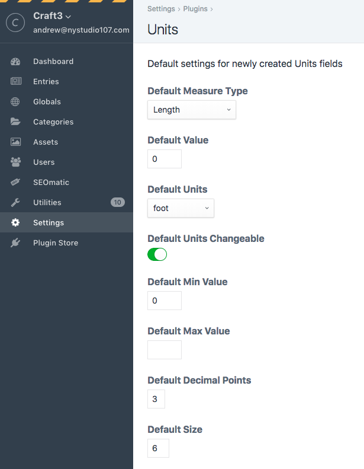

[](https://scrutinizer-ci.com/g/nystudio107/craft-units/?branch=v1) [](https://scrutinizer-ci.com/g/nystudio107/craft-units/?branch=v1) [](https://scrutinizer-ci.com/g/nystudio107/craft-units/build-status/v1) [](https://scrutinizer-ci.com/code-intelligence)

# Units plugin for Craft CMS 3.x

Units is a plugin that can convert between any units of measure, and comes with a Field for content authors to use.


## Requirements

This plugin requires Craft CMS 3.0.0 or later.

## Installation

To install the plugin, follow these instructions.

1. Open your terminal and go to your Craft project:

        cd /path/to/project

2. Then tell Composer to load the plugin:

        composer require nystudio107/craft-units

3. In the Control Panel, go to Settings → Plugins and click the “Install” button for Units.

You can also install Units via the **Plugin Store** in the Craft Control Panel.

## Units Overview

Units is a plugin that can convert between any units of measure, and comes with a Field for content authors to use.

You can convert from meters to feet, or liters to gallons, and anything else in between.

It also has helper functions to output values as fractions, get the parts of a value, and a whole lot more.

## Configuring Units

You don't have to do any configuration to use Units, but there are Settings available that allow you to set the default values to use for new Units fields, should you wish to do so:



These settings only affect newly created Units fields.

## Using Units

### The Units Field

Units comes with a Field named **Units** that allows you to make a field available to content authors that encapsulates a unit of measure:


This field is essentially a Craft CMS **Number** field, but with additional logic to handle units of measure.

* **Measure Type** - The type of physical quantity that this Units field represents (Length, Area, Volume, etc.)
* **Default Value** - The default value to set for this field
* **Defaults Units** - The default units to set for this field (foot, meter, mile, etc.)
* **Units Changeable** - Whether the content author should be able to change the units when editing the field value in an Entry
* **Min Value** - The minimum allowed value for the field, denominated in **Default Units**
* **Max Value** - The maximum allowed value for the field, denominated in **Default Units**
* **Decimal Points** - How many decimal points the value for the field should use
* **Size** - The size of the field, roughly the number of digits wide the field should be

If the Units Changeable lightswitch is **off**, the field will appear like this:


If the Units Changeable lightswitch is **on**, the field will appear like this:


If the content author does change the units the field is denominated in, Units will normalize the value to ensure that it's compared against the **Defaults Units** that the **Min Value** and **Max Value** are set to.

### Templating

### Creating a Unit of Measure

To create a new unit of measure, you do:

```twig

```

The string after the `craft.units.` determines the type of physical quantity for the unit of measure. The first parameter is the value to assign to the unit of measure, and the second parameter is the unit that it's denominated in.

The following physical quantities are available:
* **Acceleration** - ``
* **Angle** - ``
* **Area** - ``
* **ElectricCurrent** - ``
* **Energy** - ``
* **Length** - ``
* **Luminosity** - ``
* **Mass** - ``
* **Pressure** - ``
* **Quantity** - ``
* **SolidAngle** - ``
* **Temperature** - ``
* **Time** - ``
* **Velocity** - ``
* **Volume** - ``

**N.B.:** For a complete list of all of the available units (and their aliases) for each physical quantity, see the **Units Reference** section.

### Getting a Unit of Measure from a Field

To get a unit of measure from a field, simply do:

```twig

```

This gives you the unit of measure just as if you had created it via Twig.

### Using Unit of Measure in your Templates

#### Outputting Values in Decimal

To output a unit of measure as a decimal value along with its units, simply do:

```twig

{{ unitOfMeasure }}
```

...or from an Entry:

```twig
{{ entry.someUnit }}
```

Output:

```twig
10.0 meters
```

To output just the decimal value:

```twig

{{ unitOfMeasure.value }}
```

...or from an Entry:

```twig
{{ entry.someUnit.value }}
```


Output:

```twig
10.0
```

To output just the units:

```twig

{{ unitOfMeasure.units }}
```

...or from an Entry:

```twig
{{ entry.someUnit.units }}
```

Output:

```twig
meters
```

#### Outputting Values as Fractions

To output a unit of measure as a fractional value along with its units, simply do:

```twig

{{ unitOfMeasure.toFraction }}
```

...or from an Entry:

```twig
{{ entry.someUnit.toFraction }}
```

Output:

```twig
10 1/3 feet
```

To output just the fractional value:

```twig

{{ unitOfMeasure.valueFraction }}
```

...or from an Entry:

```twig
{{ entry.someUnit.valueFraction }}
```


Output:

```twig
10 1/3
```

**N.B.:** if you'd like to convert the text of the fractions to actual unicode fraction characters, you can use the [Typogrify](https://github.com/nystudio107/craft-typogrify) plugin to do that for you.

#### Converting Values in Decimal

To convert values in decimal from one unit to another, simply do:

```twig

{{ unitOfMeasure.toUnit('feet') }}
```

...or from an Entry:

```twig
{{ entry.someUnit.toUnit('feet') }}
```

Output:

```twig
32.808398950131
```

**N.B.:** For a complete list of all of the available units (and their aliases) for each physical quantity, see the **Units Reference** section.

#### Converting Values as Fractions

To convert values as fractions from one unit to another, simply do:

```twig

{{ unitOfMeasure.toUnitFraction('feet') }}
```

...or from an Entry:

```twig
{{ entry.someUnit.toUnitFraction('feet') }}
```

Output:

```twig
33 1/3
```

**N.B.:** if you'd like to convert the text of the fractions to actual unicode fraction characters, you can use the [Typogrify](https://github.com/nystudio107/craft-typogrify) plugin to do that for you.

**N.B.:** For a complete list of all of the available units (and their aliases) for each physical quantity, see the **Units Reference** section.

#### Performing Arithmetic on Units of Measure

Units allows you to perform arithmetic on units of measure that are denominated in different units.

##### Adding Units of Measure

Two add two units of measure together, simply do:

```twig



{{ result }}
```

Output:

```twig
13.048 m
```

The `result` that is returned is a full units of measure object that you can do `result.value`, `result.units`, etc. on just like any other unit of measure.

Note that the units of the `result` are denominated in the unit of measure that is performing the addition.

##### Subtracting Units of Measure

Two add two units of measure together, simply do:

```twig



{{ result }}
```

Output:

```twig
6.952 m
```

The `result` that is returned is a full units of measure object that you can do `result.value`, `result.units`, etc. on just like any other unit of measure.

Note that the units of the `result` are denominated in the unit of measure that is performing the subtraction.

#### Advanced Usage

##### Getting Value Parts in Decimal

To get the whole number and decimal part of a unit value, simply do:

```twig


{{ unitParts[0] }}
{{ unitParts[1] }}
```
Output:

```twig
10
0.3333333
```

##### Getting Value Parts as Fractions

To get the whole number and fractional part of a unit value, simply do:

```twig


{{ unitParts[0] }}
{{ unitParts[1] }}
```
Output:

```twig
10
1/3
```

**N.B.:** if you'd like to convert the text of the fractions to actual unicode fraction characters, you can use the [Typogrify](https://github.com/nystudio107/craft-typogrify) plugin to do that for you.

##### Getting Available Units

To get an array of all of the units available for a given units of measure, simply do:

```twig



    {{ unit }}

```

Output:

```twig
meter
yottameter
zettameter
exameter
petameter
terameter
gigameter
megameter
kilometer
hectometer
decameter
decimeter
centimeter
millimeter
micrometer
nanometer
picometer
femtometer
attometer
zeptometer
yoctometer
foot
inch
mile
yard
nautical mile
mil
au
```

The `false` parameter causes it to just list the units, and none of their aliases. To see the available units _and_ their aliases, do:

```twig



    {{ unit }}

```

In this loop, `aliases` will be an array of aliases for a given unit (if any).

## Units Reference

Units uses the [PHP Units of Measure](https://github.com/PhpUnitsOfMeasure/php-units-of-measure) library, so it offers quite a bit of flexibility.

Below is a list of all of the types of physical quantity measures that Units supports, and a list of all of the units that can be used for each physical quantity.

The first item in the units list is the unit itself, and any sub-list items are aliases for that unit. For instance, `craft.units.length(10, 'meters')` is the same as `craft.units.length(10, 'm')`.

### Acceleration
* m/s^2
   * m/s²
   * meter per second squared
   * meters per second squared
   * metre per second squared
   * metres per second squared

### Angle
* rad
   * radian
   * radians
* Yrad
   * yottaradian
   * yottaradians
* Zrad
   * zettaradian
   * zettaradians
* Erad
   * exaradian
   * exaradians
* Prad
   * petaradian
   * petaradians
* Trad
   * teraradian
   * teraradians
* Grad
   * gigaradian
   * gigaradians
* Mrad
   * megaradian
   * megaradians
* krad
   * kiloradian
   * kiloradians
* hrad
   * hectoradian
   * hectoradians
* darad
   * decaradian
   * decaradians
* drad
   * deciradian
   * deciradians
* crad
   * centiradian
   * centiradians
* mrad
   * milliradian
   * milliradians
* µrad
   * microradian
   * microradians
* nrad
   * nanoradian
   * nanoradians
* prad
   * picoradian
   * picoradians
* frad
   * femtoradian
   * femtoradians
* arad
   * attoradian
   * attoradians
* zrad
   * zeptoradian
   * zeptoradians
* yrad
   * yoctoradian
   * yoctoradians
* deg
   * °
   * degree
   * degrees
* Ydeg
   * yottadegree
   * yottadegrees
* Zdeg
   * zettadegree
   * zettadegrees
* Edeg
   * exadegree
   * exadegrees
* Pdeg
   * petadegree
   * petadegrees
* Tdeg
   * teradegree
   * teradegrees
* Gdeg
   * gigadegree
   * gigadegrees
* Mdeg
   * megadegree
   * megadegrees
* kdeg
   * kilodegree
   * kilodegrees
* hdeg
   * hectodegree
   * hectodegrees
* dadeg
   * decadegree
   * decadegrees
* ddeg
   * decidegree
   * decidegrees
* cdeg
   * centidegree
   * centidegrees
* mdeg
   * millidegree
   * millidegrees
* µdeg
   * microdegree
   * microdegrees
* ndeg
   * nanodegree
   * nanodegrees
* pdeg
   * picodegree
   * picodegrees
* fdeg
   * femtodegree
   * femtodegrees
* adeg
   * attodegree
   * attodegrees
* zdeg
   * zeptodegree
   * zeptodegrees
* ydeg
   * yoctodegree
   * yoctodegrees
* arcmin
   * ′
   * arcminute
   * arcminutes
   * amin
   * am
   * MOA
   * arcsecond
   * arcseconds
* arcsec
   * ″
   * asec
   * as
* yottaarcsec
   * yottaarcsecond
   * yottaarcseconds
   * Yasec
   * Yas
* zettaarcsec
   * zettaarcsecond
   * zettaarcseconds
   * Zasec
   * Zas
* exaarcsec
   * exaarcsecond
   * exaarcseconds
   * Easec
   * Eas
* petaarcsec
   * petaarcsecond
   * petaarcseconds
   * Pasec
   * Pas
* teraarcsec
   * teraarcsecond
   * teraarcseconds
   * Tasec
   * Tas
* gigaarcsec
   * gigaarcsecond
   * gigaarcseconds
   * Gasec
   * Gas
* megaarcsec
   * megaarcsecond
   * megaarcseconds
   * Masec
   * Mas
* kiloarcsec
   * kiloarcsecond
   * kiloarcseconds
   * kasec
   * kas
* hectoarcsec
   * hectoarcsecond
   * hectoarcseconds
   * hasec
   * has
* decaarcsec
   * decaarcsecond
   * decaarcseconds
   * daasec
   * daas
* deciarcsec
   * deciarcsecond
   * deciarcseconds
   * dasec
   * das
* centiarcsec
   * centiarcsecond
   * centiarcseconds
   * casec
   * cas
* milliarcsec
   * milliarcsecond
   * milliarcseconds
   * masec
   * mas
* microarcsec
   * microarcsecond
   * microarcseconds
   * µasec
   * µas
* nanoarcsec
   * nanoarcsecond
   * nanoarcseconds
   * nasec
   * nas
* picoarcsec
   * picoarcsecond
   * picoarcseconds
   * pasec
   * pas
* femtoarcsec
   * femtoarcsecond
   * femtoarcseconds
   * fasec
   * fas
* attoarcsec
   * attoarcsecond
   * attoarcseconds
   * aasec
   * aas
* zeptoarcsec
   * zeptoarcsecond
   * zeptoarcseconds
   * zasec
   * zas
* yoctoarcsec
   * yoctoarcsecond
   * yoctoarcseconds
   * yasec
   * yas

### Area
* m^2
   * m²
   * meter squared
   * square meter
   * square meters
   * meters squared
   * metre squared
   * metres squared
* mm^2
   * mm²
   * millimeter squared
   * square millimeter
   * square millimeters
   * millimeters squared
   * millimetre squared
   * millimetres squared
* cm^2
   * cm²
   * centimeter squared
   * square centimeter
   * square centimeters
   * centimeters squared
   * centimetre squared
   * centimetres squared
* dm^2
   * dm²
   * decimeter squared
   * square decimeters
   * square decimeter
   * decimeters squared
   * decimetre squared
   * decimetres squared
* km^2
   * km²
   * kilometer squared
   * kilometers squared
   * square kilometer
   * square kilometers
   * kilometre squared
   * kilometres squared
* ft^2
   * ft²
   * foot squared
   * square foot
   * square feet
   * feet squared
* in^2
   * in²
   * inch squared
   * square inch
   * square inches
   * inches squared
* mi^2
   * mi²
   * mile squared
   * miles squared
   * square mile
   * square miles
* yd^2
   * yd²
   * yard squared
   * yards squared
   * square yard
   * square yards
* a
   * are
   * ares
* daa
   * decare
   * decares
* ha
   * hectare
   * hectares
* ac
   * acre
   * acres

### ElectricCurrent
* A
   * amp
   * amps
   * ampere
   * amperes
* YA
   * yottaamp
   * yottaamps
   * yottaampere
   * yottaamperes
* ZA
   * zettaamp
   * zettaamps
   * zettaampere
   * zettaamperes
* EA
   * exaamp
   * exaamps
   * exaampere
   * exaamperes
* PA
   * petaamp
   * petaamps
   * petaampere
   * petaamperes
* TA
   * teraamp
   * teraamps
   * teraampere
   * teraamperes
* GA
   * gigaamp
   * gigaamps
   * gigaampere
   * gigaamperes
* MA
   * megaamp
   * megaamps
   * megaampere
   * megaamperes
* kA
   * kiloamp
   * kiloamps
   * kiloampere
   * kiloamperes
* hA
   * hectoamp
   * hectoamps
   * hectoampere
   * hectoamperes
* daA
   * decaamp
   * decaamps
   * decaampere
   * decaamperes
* dA
   * deciamp
   * deciamps
   * deciampere
   * deciamperes
* cA
   * centiamp
   * centiamps
   * centiampere
   * centiamperes
* mA
   * milliamp
   * milliamps
   * milliampere
   * milliamperes
* µA
   * microamp
   * microamps
   * microampere
   * microamperes
* nA
   * nanoamp
   * nanoamps
   * nanoampere
   * nanoamperes
* pA
   * picoamp
   * picoamps
   * picoampere
   * picoamperes
* fA
   * femtoamp
   * femtoamps
   * femtoampere
   * femtoamperes
* aA
   * attoamp
   * attoamps
   * attoampere
   * attoamperes
* zA
   * zeptoamp
   * zeptoamps
   * zeptoampere
   * zeptoamperes
* yA
   * yoctoamp
   * yoctoamps
   * yoctoampere
   * yoctoamperes

### Energy
* J
   * joule
   * joules
* YJ
   * yottajoule
   * yottajoules
* ZJ
   * zettajoule
   * zettajoules
* EJ
   * exajoule
   * exajoules
* PJ
   * petajoule
   * petajoules
* TJ
   * terajoule
   * terajoules
* GJ
   * gigajoule
   * gigajoules
* MJ
   * megajoule
   * megajoules
* kJ
   * kilojoule
   * kilojoules
* hJ
   * hectojoule
   * hectojoules
* daJ
   * decajoule
   * decajoules
* dJ
   * decijoule
   * decijoules
* cJ
   * centijoule
   * centijoules
* mJ
   * millijoule
   * millijoules
* µJ
   * microjoule
   * microjoules
* nJ
   * nanojoule
   * nanojoules
* pJ
   * picojoule
   * picojoules
* fJ
   * femtojoule
   * femtojoules
* aJ
   * attojoule
   * attojoules
* zJ
   * zeptojoule
   * zeptojoules
* yJ
   * yoctojoule
   * yoctojoules
* Wh
   * watt hour
   * watt hours
* YWh
   * yottawatt hour
   * yottawatt hours
* ZWh
   * zettawatt hour
   * zettawatt hours
* EWh
   * exawatt hour
   * exawatt hours
* PWh
   * petawatt hour
   * petawatt hours
* TWh
   * terawatt hour
   * terawatt hours
* GWh
   * gigawatt hour
   * gigawatt hours
* MWh
   * megawatt hour
   * megawatt hours
* kWh
   * kilowatt hour
   * kilowatt hours
* hWh
   * hectowatt hour
   * hectowatt hours
* daWh
   * decawatt hour
   * decawatt hours
* dWh
   * deciwatt hour
   * deciwatt hours
* cWh
   * centiwatt hour
   * centiwatt hours
* mWh
   * milliwatt hour
   * milliwatt hours
* µWh
   * microwatt hour
   * microwatt hours
* nWh
   * nanowatt hour
   * nanowatt hours
* pWh
   * picowatt hour
   * picowatt hours
* fWh
   * femtowatt hour
   * femtowatt hours
* aWh
   * attowatt hour
   * attowatt hours
* zWh
   * zeptowatt hour
   * zeptowatt hours
* yWh
   * yoctowatt hour
   * yoctowatt hours

### Length
* m
   * meter
   * meters
   * metre
   * metres
* Ym
   * yottameter
   * yottameters
   * yottametre
   * yottametres
* Zm
   * zettameter
   * zettameters
   * zettametre
   * zettametres
* Em
   * exameter
   * exameters
   * exametre
   * exametres
* Pm
   * petameter
   * petameters
   * petametre
   * petametres
* Tm
   * terameter
   * terameters
   * terametre
   * terametres
* Gm
   * gigameter
   * gigameters
   * gigametre
   * gigametres
* Mm
   * megameter
   * megameters
   * megametre
   * megametres
* km
   * kilometer
   * kilometers
   * kilometre
   * kilometres
* hm
   * hectometer
   * hectometers
   * hectometre
   * hectometres
* dam
   * decameter
   * decameters
   * decametre
   * decametres
* dm
   * decimeter
   * decimeters
   * decimetre
   * decimetres
* cm
   * centimeter
   * centimeters
   * centimetre
   * centimetres
* mm
   * millimeter
   * millimeters
   * millimetre
   * millimetres
* µm
   * micrometer
   * micrometers
   * micrometre
   * micrometres
* nm
   * nanometer
   * nanometers
   * nanometre
   * nanometres
* pm
   * picometer
   * picometers
   * picometre
   * picometres
* fm
   * femtometer
   * femtometers
   * femtometre
   * femtometres
* am
   * attometer
   * attometers
   * attometre
   * attometres
* zm
   * zeptometer
   * zeptometers
   * zeptometre
   * zeptometres
* ym
   * yoctometer
   * yoctometers
   * yoctometre
   * yoctometres
* ft
   * foot
   * feet
* in
   * inch
   * inches
* mi
   * mile
   * miles
* yd
   * yard
   * yards
* M
   * nautical mile
   * nautical miles
   * nmi
   * NM
* mil
* AU
   * au
   * astronomical unit
   * astronomical units

### LuminousIntensity
* cd
   * candela
* Ycd
   * yottacandela
* Zcd
   * zettacandela
* Ecd
   * exacandela
* Pcd
   * petacandela
* Tcd
   * teracandela
* Gcd
   * gigacandela
* Mcd
   * megacandela
* kcd
   * kilocandela
* hcd
   * hectocandela
* dacd
   * decacandela
* dcd
   * decicandela
* ccd
   * centicandela
* mcd
   * millicandela
* µcd
   * microcandela
* ncd
   * nanocandela
* pcd
   * picocandela
* fcd
   * femtocandela
* acd
   * attocandela
* zcd
   * zeptocandela
* ycd
   * yoctocandela

### Mass
* kg
   * kilogram
   * kilograms
* Yg
   * yottagram
   * yottagrams
* Zg
   * zettagram
   * zettagrams
* Eg
   * exagram
   * exagrams
* Pg
   * petagram
   * petagrams
* Tg
   * teragram
   * teragrams
* Gg
   * gigagram
   * gigagrams
* Mg
   * megagram
   * megagrams
* hg
   * hectogram
   * hectograms
* dag
   * decagram
   * decagrams
* g
   * gram
   * grams
* dg
   * decigram
   * decigrams
* cg
   * centigram
   * centigrams
* mg
   * milligram
   * milligrams
* µg
   * microgram
   * micrograms
* ng
   * nanogram
   * nanograms
* pg
   * picogram
   * picograms
* fg
   * femtogram
   * femtograms
* ag
   * attogram
   * attograms
* zg
   * zeptogram
   * zeptograms
* yg
   * yoctogram
   * yoctograms
* t
   * ton
   * tons
   * tonne
   * tonnes
* lb
   * lbs
   * pound
   * pounds
* oz
   * ounce
   * ounces
* st
   * stone
   * stones

### Pressure
* Pa
   * pascal
* YPa
   * yottapascal
* ZPa
   * zettapascal
* EPa
   * exapascal
* PPa
   * petapascal
* TPa
   * terapascal
* GPa
   * gigapascal
* MPa
   * megapascal
* kPa
   * kilopascal
* hPa
   * hectopascal
* daPa
   * decapascal
* dPa
   * decipascal
* cPa
   * centipascal
* mPa
   * millipascal
* µPa
   * micropascal
* nPa
   * nanopascal
* pPa
   * picopascal
* fPa
   * femtopascal
* aPa
   * attopascal
* zPa
   * zeptopascal
* yPa
   * yoctopascal
* atm
   * atmosphere
   * atmospheres
* bar
* Ybar
* Zbar
* Ebar
* Pbar
* Tbar
* Gbar
* Mbar
* kbar
* hbar
* dabar
* dbar
* cbar
* mbar
* µbar
* nbar
* pbar
* fbar
* abar
* zbar
* ybar
* inHg
   * inches of mercury
* mmHg
   * millimeters of mercury
   * millimetres of mercury
   * torr
* psi
   * pounds per square inch

### Quantity
* mol
   * mole
   * moles
* Ymol
   * yottamole
   * yottamoles
* Zmol
   * zettamole
   * zettamoles
* Emol
   * examole
   * examoles
* Pmol
   * petamole
   * petamoles
* Tmol
   * teramole
   * teramoles
* Gmol
   * gigamole
   * gigamoles
* Mmol
   * megamole
   * megamoles
* kmol
   * kilomole
   * kilomoles
* hmol
   * hectomole
   * hectomoles
* damol
   * decamole
   * decamoles
* dmol
   * decimole
   * decimoles
* cmol
   * centimole
   * centimoles
* mmol
   * millimole
   * millimoles
* µmol
   * micromole
   * micromoles
* nmol
   * nanomole
   * nanomoles
* pmol
   * picomole
   * picomoles
* fmol
   * femtomole
   * femtomoles
* amol
   * attomole
   * attomoles
* zmol
   * zeptomole
   * zeptomoles
* ymol
   * yoctomole
   * yoctomoles

### SolidAngle
* sr
   * steradian
   * steradians
* Ysr
   * yottasteradian
   * yottasteradians
* Zsr
   * zettasteradian
   * zettasteradians
* Esr
   * exasteradian
   * exasteradians
* Psr
   * petasteradian
   * petasteradians
* Tsr
   * terasteradian
   * terasteradians
* Gsr
   * gigasteradian
   * gigasteradians
* Msr
   * megasteradian
   * megasteradians
* ksr
   * kilosteradian
   * kilosteradians
* hsr
   * hectosteradian
   * hectosteradians
* dasr
   * decasteradian
   * decasteradians
* dsr
   * decisteradian
   * decisteradians
* csr
   * centisteradian
   * centisteradians
* msr
   * millisteradian
   * millisteradians
* µsr
   * microsteradian
   * microsteradians
* nsr
   * nanosteradian
   * nanosteradians
* psr
   * picosteradian
   * picosteradians
* fsr
   * femtosteradian
   * femtosteradians
* asr
   * attosteradian
   * attosteradians
* zsr
   * zeptosteradian
   * zeptosteradians
* ysr
   * yoctosteradian
   * yoctosteradians

### Temperature
* K
   * °K
   * kelvin
* YK
   * yottakelvin
* ZK
   * zettakelvin
* EK
   * exakelvin
* PK
   * petakelvin
* TK
   * terakelvin
* GK
   * gigakelvin
* MK
   * megakelvin
* kK
   * kilokelvin
* hK
   * hectokelvin
* daK
   * decakelvin
* dK
   * decikelvin
* cK
   * centikelvin
* mK
   * millikelvin
* µK
   * microkelvin
* nK
   * nanokelvin
* pK
   * picokelvin
* fK
   * femtokelvin
* aK
   * attokelvin
* zK
   * zeptokelvin
* yK
   * yoctokelvin
* °C
   * C
   * celsius
* °F
   * F
   * fahrenheit
* °R
   * R
   * rankine
* °De
   * De
   * delisle
* °N
   * N
   * newton
* °Ré
   * °Re
   * Ré
   * Re
   * réaumur
   * reaumur
* °Rø
   * °Ro
   * Rø
   * Ro
   * rømer
   * romer

### Time
* s
   * sec
   * secs
   * second
   * seconds
* Ys
   * yottasec
   * yottasecs
   * yottasecond
   * yottaseconds
* Zs
   * zettasec
   * zettasecs
   * zettasecond
   * zettaseconds
* Es
   * exasec
   * exasecs
   * exasecond
   * exaseconds
* Ps
   * petasec
   * petasecs
   * petasecond
   * petaseconds
* Ts
   * terasec
   * terasecs
   * terasecond
   * teraseconds
* Gs
   * gigasec
   * gigasecs
   * gigasecond
   * gigaseconds
* Ms
   * megasec
   * megasecs
   * megasecond
   * megaseconds
* ks
   * kilosec
   * kilosecs
   * kilosecond
   * kiloseconds
* hs
   * hectosec
   * hectosecs
   * hectosecond
   * hectoseconds
* das
   * decasec
   * decasecs
   * decasecond
   * decaseconds
* ds
   * decisec
   * decisecs
   * decisecond
   * deciseconds
* cs
   * centisec
   * centisecs
   * centisecond
   * centiseconds
* ms
   * millisec
   * millisecs
   * millisecond
   * milliseconds
* µs
   * microsec
   * microsecs
   * microsecond
   * microseconds
* ns
   * nanosec
   * nanosecs
   * nanosecond
   * nanoseconds
* ps
   * picosec
   * picosecs
   * picosecond
   * picoseconds
* fs
   * femtosec
   * femtosecs
   * femtosecond
   * femtoseconds
* as
   * attosec
   * attosecs
   * attosecond
   * attoseconds
* zs
   * zeptosec
   * zeptosecs
   * zeptosecond
   * zeptoseconds
* ys
   * yoctosec
   * yoctosecs
   * yoctosecond
   * yoctoseconds
* m
   * min
   * mins
   * minute
   * minutes
* h
   * hr
   * hrs
   * hour
   * hours
* d
   * day
   * days
* w
   * wk
   * wks
   * week
   * weeks
* yr
   * year
   * years
   * gregorian year
   * gregorian years
* decade
   * decades
* century
   * centuries
* millennium
   * millennia
* jyr
   * julian year
   * julian years

### Velocity
* m/s
   * meters/sec
   * meters per second
   * meter per second
   * metres per second
   * metre per second
* km/h
   * km/hour
   * kilometer per hour
   * kilometers per hour
   * kilometre per hour
   * kilometres per hour
* ft/s
   * feet/sec
   * feet per second
* mph
   * miles/hour
   * miles per hour
* knot
   * knots

### Volume
* m^3
   * m³
   * cubic meter
   * cubic meters
   * cubic metre
   * cubic metres
* mm^3
   * mm³
   * cubic millimeter
   * cubic millimeters
   * cubic millimetre
   * cubic millimetres
* cm^3
   * cm³
   * cubic centimeter
   * cubic centimeters
   * cubic centimetre
   * cubic centimetres
* dm^3
   * dm³
   * cubic decimeter
   * cubic decimeters
   * cubic decimetre
   * cubic decimetres
* km^3
   * km³
   * cubic kilometer
   * cubic kilometers
   * cubic kilometre
   * cubic kilometres
* ft^3
   * ft³
   * cubic foot
   * cubic feet
* in^3
   * in³
   * cubic inch
   * cubic inches
* yd^3
   * yd³
   * cubic yard
   * cubic yards
* ml
   * milliliter
   * milliliters
   * millilitre
   * millilitres
* cl
   * centiliter
   * centiliters
   * centilitre
   * centilitres
* dl
   * deciliter
   * deciliters
   * decilitre
   * decilitres
* l
   * liter
   * liters
   * litre
   * litres
* dal
   * decaliter
   * decaliters
   * decalitre
   * decalitres
* hl
   * hectoliter
   * hectoliters
   * hectolitre
   * hectolitres
* cup
   * cup
   * cups
* tsp
   * teaspoon
   * teaspoons
* tbsp
   * tablespoon
   * tablespoons
* gal
   * gallon
   * gallons
   * us gal
* qt
   * quart
   * quarts
   * qts
   * liq qt
* fl oz
   * fluid ounce
   * fluid ounces
   * fluid oz
   * fl. oz.
   * oz. fl.
* pt
   * pint
   * pints
   * liq pt

## Units Roadmap

Some things to do, and ideas for potential features:

* Add the ability to control what units appear in the list (because who uses _yottameters_?)

Brought to you by [nystudio107](https://nystudio107.com/)
